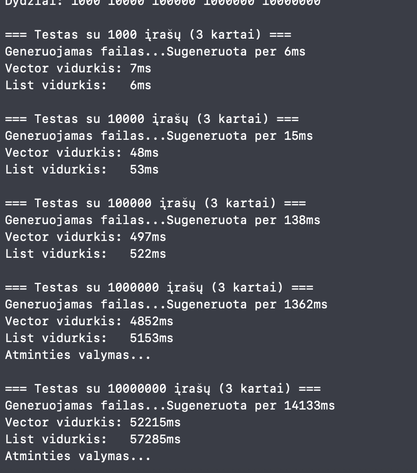
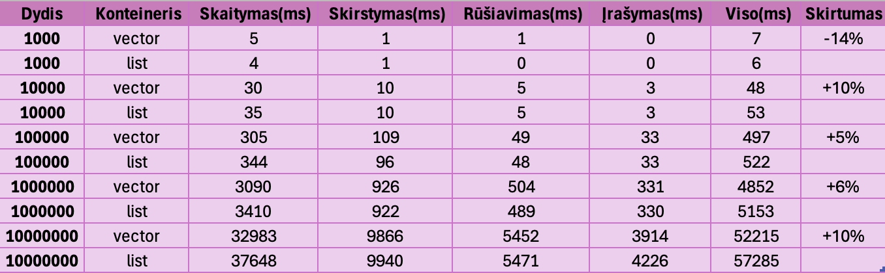
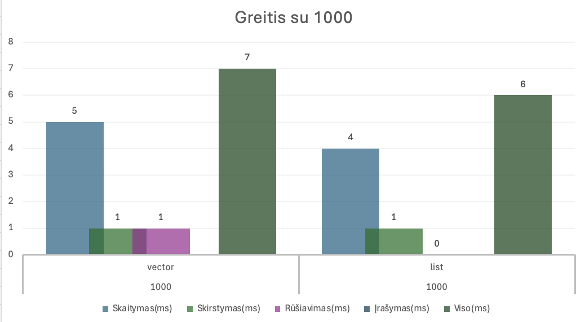
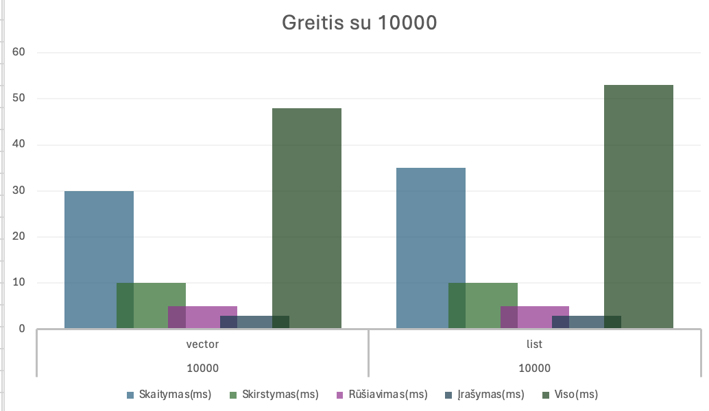
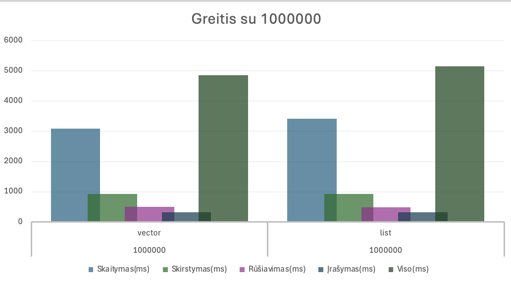
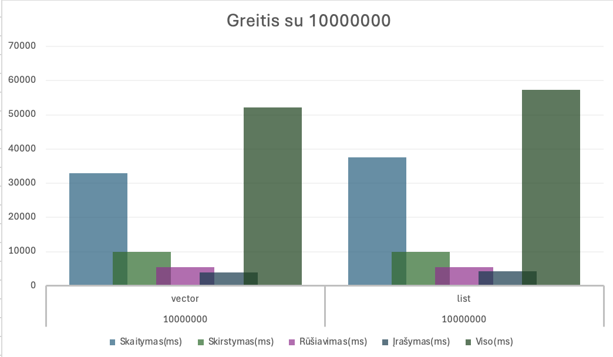

Studentų Rūšiavimo Sistema v1.0

Release Istorija:
v0.1 (2025-09-25) - pradiinė versija:

Galimybė įvesti nežinomą namų darbų kiekį (vartotojas pats nusprendžia, kada baigti įvestį).
Galimybė generuoti atsitiktinius pažymius tiek namų darbams, tiek egzaminui.
Sukurtas programos veiksmų pasirinkimo meniu.
Visas kodas realizuotas viename .cpp faile.
Programa paruošta tolesniam plėtojimui ir sinchronizuota su GitHub sistema.

v0.2 (2025-10-03):
Sukurta atsitiktinių studentų sąrašų generavimo galimybė.
Sugeneruoti penki duomenų failai, turintys po 1 000, 10 000, 100 000, 1 000 000 ir 10 000 000 įrašų.
Įdiegta studentų skirstymo funkcija:
Studentai, kurių galutinis balas < 5.0 – „vargšiukai“.
Studentai, kurių galutinis balas ≥ 5.0 – „kietakiai“.
Kiekviena grupė išvedama į atskirą failą.
Pridėtas programos veikimo spartos matavimas.
Atliktas kodo reorganizavimas.

v0.3 (2025-10-30):
Šioje versijoje atliktas konteinerių veikimo spartos tyrimas.

Konteinerių (Vector vs List) testavimo rezultatai

Testavimo Sistemos Parametrai:
- Modelis: MacBook Air
- Chip: Apple M2
- CPU Cores: 8 (4 performance + 4 efficiency)
- RAM: 8 GB Unified Memory
- Storage: 256 GB NVMe SSD
- OS: macOS Sonoma

Testavimo Rezultatai

Terminalo Rezultatai

Detali Rezultatų Lentelė

Grafine Analize

1,000 irasu

10,000 irasu

1,000,000 irasu

10,000,000 irasu

Išvados

Vector yra 5-10% greitesnis uz List didesniems duomenu kiekiams

Testavimo Metodologija
- Kiekvienas testas atliktas 3 kartus ir paimtas vidurkis
- Naudoti failai: 1K, 10K, 100K, 1M, 10M irasu
- Kiekvienas studentas turi 5 namu darbu pazymius + egzamina

v1.0 (2025-11-13):
- Visos 3 strategijos implementuotos (Vector ir List) 
- Išsamus konteinerių palyginimas (Vector vs List) 
- Atminties naudojimo matavimai ir analizė 
- Automatinis testavimas su įvairiais duomenų kiekiais 
- CMake build sistema 
- Pilna dokumentacija

Naudojimosi InstrukcijaNaudojimosi Instrukcija:
Programa palaiko 6 veikimo režimus: 
Pagrindiniai Režimai: 
f - Skaityti iš failo - apdoroti egzistuojantį failą 
g - Generuoti failą - sukurti naują testų failą 
p - Rankinis įvedimas - įvesti duomenis rankiniu būdu 
Testavimo Režimai: 
t - Testuoti konteinerius - Vector vs List palyginimas 
s - Strategijų palyginimas - visų 3 strategijų testavimas 
n - Naudoti strategiją - pasirinkti konkrečią strategiją

Testavimo rezultai(parametrai tokie patys kaip konteinerių testavimo):

Failas: palyginimo_test_1000.txt
Dydis, Strategija, Konteineris, Laikas(ms), Atmintis(baitai)
1000,strategija_1,vector,0,124048
1000,strategija_1,list,0,140048
1000,strategija_2,vector,0,124048
1000,strategija_2,list,0,140048
1000,strategija_3,vector,0,124048
1000,strategija_3,list,0,140048

Failas: palyginimo_test_10000.txt
Dydis, Strategija, Konteineris, Laikas(ms), Atmintis(baitai)
10000,strategija_1,vector,8,1240048
10000,strategija_1,list,7,1400048
10000,strategija_2,vector,7,1240048
10000,strategija_2,list,5,1400048
10000,strategija_3,vector,7,1240048
10000,strategija_3,list,5,1400048

Failas: palyginimo_test_100000.txt
Dydis, Strategija, Konteineris, Laikas(ms), Atmintis(baitai)
100000,strategija_1,vector,82,12400048
100000,strategija_1,list,80,14000048
100000,strategija_2,vector,72,12400048
100000,strategija_2,list,60,14000048
100000,strategija_3,vector,72,12400048
100000,strategija_3,list,58,14000048

Failas: palyginimo_test_1000000.txt
Dydis, Strategija, Konteineris, Laikas(ms), Atmintis(baitai)
1000000,strategija_1,vector,860,124000048
1000000,strategija_1,list,815,140000048
1000000,strategija_2,vector,725,124000048
1000000,strategija_2,list,596,140000048
1000000,strategija_3,vector,732,124000048
1000000,strategija_3,list,590,140000048

Failas: palyginimo_test_10000000.txt
Dydis, Strategija, Konteineris, Laikas(ms), Atmintis(baitai)
10000000,strategija_1,vector,9012,1240000048
10000000,strategija_1,list,8568,1400000048
10000000,strategija_2,vector,7527,1240000048
10000000,strategija_2,list,5889,1400000048
10000000,strategija_3,vector,7526,1240000048
10000000,strategija_3,list,6153,1400000048

Strategijų Aprašymas:
Strategija 1: Dvi naujos grupės
Sukuriami du nauji konteineriai
Studentai kopijuojami į atitinkamą grupę

Strategija 2: Viena nauja grupė + trynimas
Sukuriamas tik vargsiukų konteineris
Kietakiai lieka originaliame konteineryje

Strategija 3: STL algoritmai
Naudojami std::partition ir std::move
Efektyvus elementų perkėlimas

Išvados ir Rekomendacijos
-Greičiausias variantas: List su Strategija 3
-Vector užima mažiau atminties nei List
-Atminties skirtumas proporcingas duomenų kiekiui

Galutinės Rekomendacijos:
-Greičiui: Naudoti List su Strategija 3
-Atminčiai: Naudoti Vector su Strategija 2

Testavimo Metodologija
-Kiekvienas testas atliktas 3 kartus - rezultatai yra vidurkis
-Naudoti failai: 1K, 10K, 100K, 1M, 10M įrašų
-Kiekvienas studentas turi 5 ND pažymius + egzaminą

Autorius
Veronika Rim - Vilniaus Universitetas, Duomenų mokslas.

